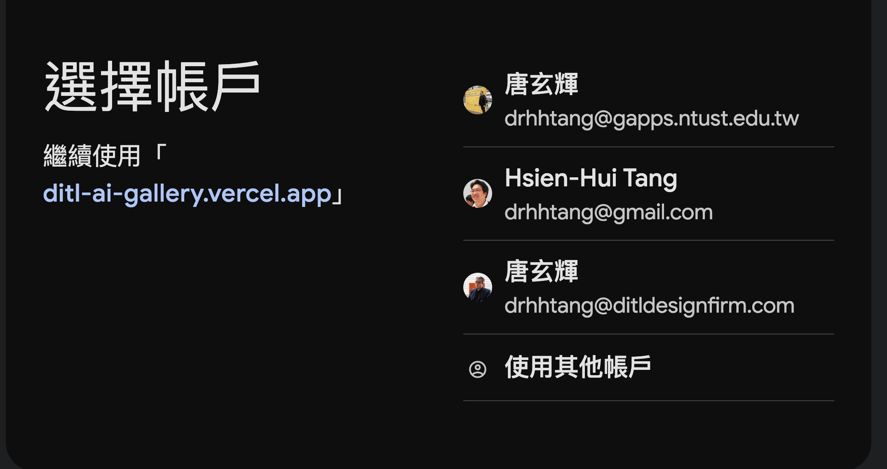
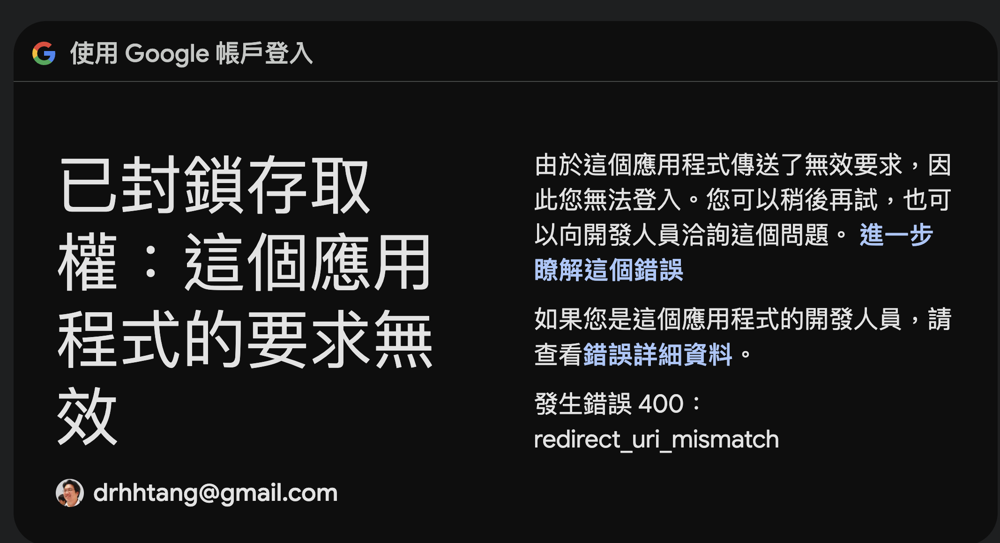
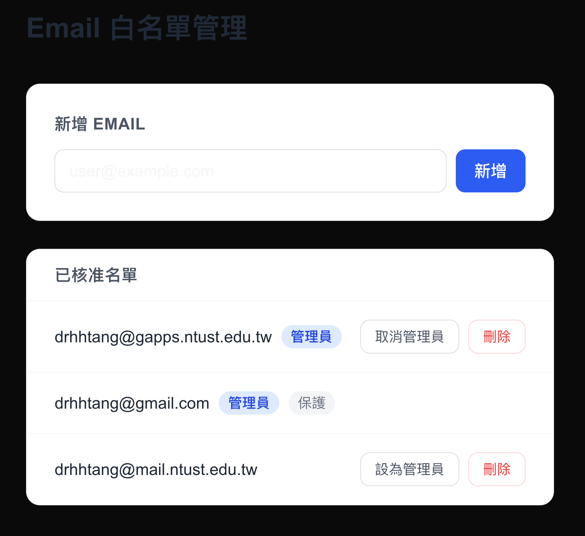
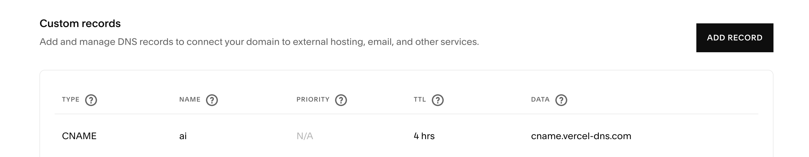
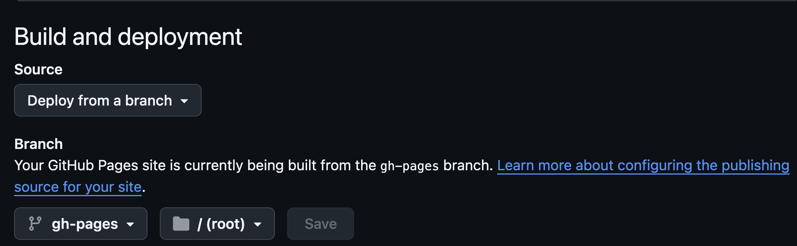
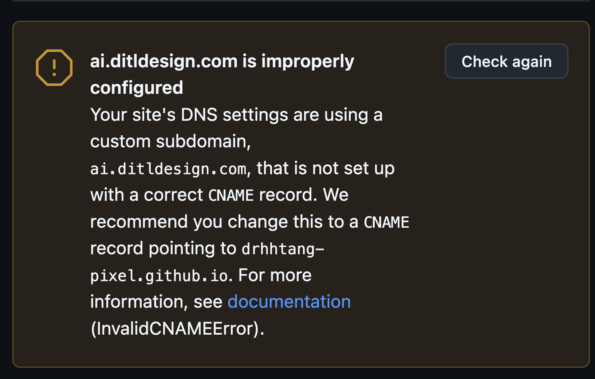
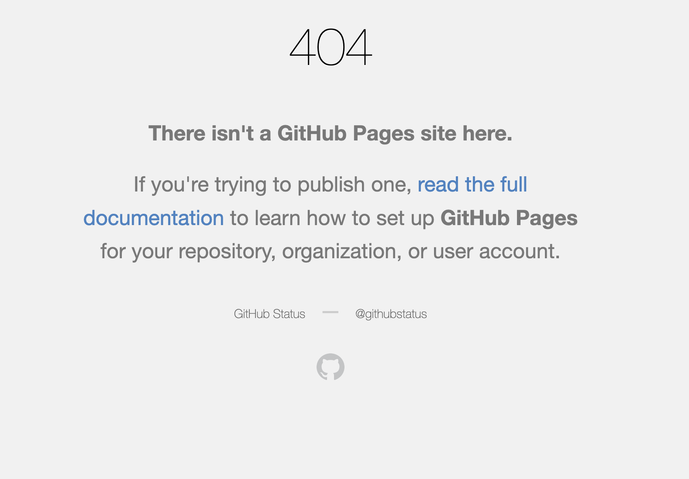

# Next.js OAuth 登入系統建立流程
## Email 白名單管制 + Supabase + 管理後台

這份文件說明如何從零開始建立一個「只有被允許的 email 才能登入」的 Next.js 網站。
使用 Google 帳號登入（OAuth），搭配 Supabase 資料庫管理白名單，部署在 Vercel。

---

## 這個系統做什麼？

使用者用 Google 帳號登入後，系統會檢查他的 email 是否在白名單裡：
- **不在白名單** → 看到拒絕頁面，無法進入
- **在白名單** → 可以瀏覽網站
- **在白名單且是管理員** → 額外可以進入後台，新增／刪除其他使用者

管理員不需要改程式碼，直接在網站後台就能管理誰可以進來。

> 使用者點擊「Google 登入」後，會看到 Google 的帳號選擇畫面：
>
> 
>
> 選擇帳號後，系統檢查白名單並決定是否放行。

```
使用者點「Google 登入」
    │
    ▼
Google 驗證身份（確認是真實 Google 帳號）
    │
    ▼
系統查詢 Supabase 資料庫
    ├─ email 不在白名單 ──→ 顯示 /403 拒絕頁面
    └─ email 在白名單
            ├─ 一般使用者 ──→ 進入網站（gallery）
            └─ 管理員 ──────→ 進入網站 + 可進 /admin/allowlist 後台
```

---

## 技術選型

| 項目 | 選擇 | 理由 |
|------|------|------|
| 框架 | Next.js 15 | Vercel 官方推薦，生態最成熟 |
| 登入套件 | Auth.js v5 (NextAuth) | Next.js 最普遍的 OAuth 整合方案 |
| OAuth 供應商 | Google | 最多人有 Google 帳號，設定簡單 |
| 資料庫 | Supabase (PostgreSQL) | 免費方案足夠、有視覺化管理介面、未來可擴充 |
| 部署平台 | Vercel | 與 Next.js 無縫整合，git push 自動部署 |

---

## 開始之前：需要準備的帳號

- Google 帳號（用來設定 OAuth 和當第一個管理員）
- Supabase 帳號（免費註冊：[supabase.com](https://supabase.com)）
- Vercel 帳號（免費註冊：[vercel.com](https://vercel.com)）
- GitHub 帳號（Vercel 從 GitHub 自動部署）
- 電腦需安裝 Node.js 18 以上（執行 `node -v` 確認版本）

---

## 前置作業

前置作業必須在寫程式碼之前完成，因為程式需要這些金鑰才能運作。

---

### 步驟一：Google Cloud Console 設定 OAuth

**這個步驟的目的**：讓你的網站可以使用「用 Google 帳號登入」功能。Google 需要你事先登記你的網站，才會允許你發起 OAuth 請求。

#### 1-1 建立 Google Cloud 專案

1. 前往 [console.cloud.google.com](https://console.cloud.google.com)，用你的 Google 帳號登入
2. 頁面上方點 **Select a project** → **New Project**
3. 填入專案名稱（例如：`ditl-ai-gallery`），點 **Create**
4. 確認左上角已切換到剛建立的專案

#### 1-2 設定 OAuth 同意畫面

> 這是使用者點「用 Google 登入」後，Google 顯示給使用者看的說明頁面

1. 左側選單 → **APIs & Services** → **OAuth consent screen**
2. User Type 選 **External**（任何 Google 帳號都可以嘗試登入，但最終由你的白名單控制誰能進來）→ 點 **Create**
3. 填寫應用程式資訊：
   - **App name**：`DITL AI Gallery`（使用者看到的名稱）
   - **User support email**：選你的 Gmail
   - **Developer contact information**：填你的 Gmail
4. 點 **Save and Continue**
5. **Scopes** 頁面：直接點 **Save and Continue**（不需要加任何權限）
6. **Test users** 頁面：直接點 **Save and Continue**
7. **Summary** 頁面：點 **Back to Dashboard**，完成

#### 1-3 建立 OAuth Client ID

> 這個步驟產生你的網站向 Google 識別身份用的金鑰

1. 左側選單 → **APIs & Services** → **Credentials**
2. 上方點 **+ Create Credentials** → **OAuth client ID**
3. **Application type** 選 **Web application**
4. **Name** 隨意填（例如：`DITL Gallery Web`）
5. **Authorized redirect URIs** 點 **+ Add URI**，加入：
   ```
   http://localhost:3000/api/auth/callback/google
   ```
   > ⚠️ 這是「Google 驗證完成後要跳轉回來的網址」。開發時用 localhost，之後部署到 Vercel 再回來補填正式網址。
6. 點 **Create**
7. 彈出視窗顯示你的金鑰，**立即複製並儲存**：
   - **Client ID**（格式：`123456789-abcdef.apps.googleusercontent.com`）→ 存為 `AUTH_GOOGLE_ID`
   - **Client Secret**（格式：`GOCSPX-xxxxxxxx`）→ 存為 `AUTH_GOOGLE_SECRET`

> ⚠️ 關掉這個彈出視窗後，Client Secret 就看不到了。如果忘記複製，需要重新建立。

---

### 步驟二：Supabase 建立專案與資料表

**這個步驟的目的**：建立儲存白名單的資料庫。白名單就是一張 `allowed_emails` 表，裡面記錄哪些 email 可以登入、誰是管理員。

#### 2-1 建立 Supabase 專案

1. 前往 [supabase.com](https://supabase.com)，登入後點 **New Project**
2. 填寫：
   - **Name**：`ditl-ai-gallery`
   - **Database Password**：設一個強密碼，**記下來**（之後不常用到，但萬一需要直連資料庫會用）
   - **Region**：選 **Northeast Asia (Tokyo)**（台灣用最近的）
3. 點 **Create new project**，等約 1 分鐘讓資料庫啟動

#### 2-2 建立白名單資料表

1. 左側選單點 **SQL Editor**
2. 點 **New query**
3. 貼上以下 SQL，把 `your-email@gmail.com` 換成你自己的 Gmail，然後點 **Run**（或按 `Cmd+Enter`）：

```sql
-- 建立白名單資料表
create table allowed_emails (
  email text primary key,          -- email 作為唯一識別，不可重複
  is_admin boolean default false,  -- 是否為管理員，預設否
  created_at timestamptz default now()  -- 加入時間，自動填入
);

-- 啟用 Row Level Security，關閉公開讀取
-- 這樣外部無法直接透過 Supabase API 讀取白名單，只有後端用 service key 才能存取
alter table allowed_emails enable row level security;

-- 插入第一個管理員（改成你自己的 Gmail）
insert into allowed_emails (email, is_admin)
values ('your-email@gmail.com', true);
```

4. 執行後應該看到 `Success. No rows returned`，代表建立成功
5. 左側選單點 **Table Editor** → 點 `allowed_emails`，確認你的 email 已經在裡面

#### 2-3 取得 API 金鑰

1. 左側選單點 **Project Settings**（齒輪圖示）→ **API**
2. 找到 **API URL** 區塊：
   - 複製網址，**去掉結尾的 `/rest/v1/`**
   - 例如看到 `https://mhuombds.supabase.co/rest/v1/`，只複製 `https://mhuombds.supabase.co`
   - 存為 `SUPABASE_URL`
3. 找到 **Project API keys** 區塊：
   - 找 **service_role** 那行（標示 secret）
   - 點右邊眼睛圖示顯示完整 key，再點 **Copy**
   - 存為 `SUPABASE_SERVICE_KEY`
   - > ⚠️ **必須用 `service_role`，絕對不能用 `anon` key**。`service_role` 可以繞過 RLS 存取資料，`anon` 被 RLS 擋住後會查不到白名單，導致所有人都被拒絕登入。

---

### 步驟三：產生 NEXTAUTH_SECRET

**這個步驟的目的**：Auth.js 用這個 secret 來加密 session token。沒有它，登入功能無法運作。

在終端機執行：

```bash
openssl rand -base64 32
```

會輸出一串隨機字串，例如：
```
K7gNU3sdo+OL0wNhqoVWhr3g6s1xYv72ol/pe/Unols=
```

複製這串字串，存為 `NEXTAUTH_SECRET`。

---

### 前置作業確認清單

全部打勾才能開始實作：

```
□ AUTH_GOOGLE_ID 已複製（格式：xxxxx.apps.googleusercontent.com）
□ AUTH_GOOGLE_SECRET 已複製（格式：GOCSPX-xxxx）
□ SUPABASE_URL 已複製（格式：https://xxxxxxxx.supabase.co，不含 /rest/v1/）
□ SUPABASE_SERVICE_KEY 已複製（service_role key，不是 anon key）
□ allowed_emails 表已建立，且初始 admin email 已插入
□ AUTH_SECRET 已產生（openssl rand -base64 32）
□ Node.js 版本 >= 18（執行 node -v 確認）
```

---

## 系統設計規格

### 資料表結構

| 欄位 | 類型 | 說明 |
|------|------|------|
| `email` | text (主鍵) | 使用者的 Google email，唯一不重複 |
| `is_admin` | boolean | 是否為管理員，預設 false |
| `created_at` | timestamptz | 加入時間，自動填入 |

### 路由與權限

| 路由 | 誰可以訪問 |
|------|-----------|
| `/login` | 所有人（登入入口） |
| `/403` | 所有人（被拒絕時顯示） |
| `/` | 白名單內的使用者 |
| `/admin/allowlist` | 白名單內且 `is_admin = true` 的使用者 |

### 管理後台介面（`/admin/allowlist`）

```
┌─────────────────────────────────────────────────────┐
│  Email 白名單管理                                     │
├─────────────────────────────────────────────────────┤
│  新增 Email                                          │
│  [___________________________________] [新增]        │
├─────────────────────────────────────────────────────┤
│  已核准名單                                           │
│                                                     │
│  admin@gmail.com                                    │
│  [管理員] （初始管理員，永遠無法被刪除或降級）          │
│                                                     │
│  student@ntust.edu.tw                               │
│  [設為管理員] [刪除]                                  │
│                                                     │
│  ta@example.com                                     │
│  [管理員] [取消管理員] [刪除]                          │
└─────────────────────────────────────────────────────┘
```

### 重要安全規則

1. **初始管理員受保護**：`BOOTSTRAP_ADMIN_EMAIL` 指定的 email 永遠無法被刪除或降級，避免系統被鎖死。
2. **最後一個 admin 保護**：當白名單中只剩一個管理員時，禁止對他進行降級或刪除操作。
3. **驗證時機**：白名單查詢在 `signIn` callback 執行（不在 middleware），原因是 Auth.js middleware 跑在 Edge Runtime，Supabase JS client 不支援 Edge Runtime。
4. **Supabase 存取**：只有後端用 `service_role` key 才能讀寫白名單，前端完全無法存取。

### 403 拒絕頁面文字

```
您的帳號尚未獲得授權。
請聯絡唐老師 your-email@gmail.com 申請存取權限。
```

---

## 環境變數總整理

開發時建立 `.env.local` 檔案，填入以下內容：

```env
# Auth.js v5（注意：v5 的變數名稱與舊版 v4 不同）
AUTH_GOOGLE_ID=xxxxx.apps.googleusercontent.com
AUTH_GOOGLE_SECRET=GOCSPX-xxxx
AUTH_SECRET=（openssl rand -base64 32 產生的字串）
AUTH_URL=http://localhost:3000   # Vercel 部署後可省略（自動偵測）

# Supabase
SUPABASE_URL=https://xxxxxxxx.supabase.co
SUPABASE_SERVICE_KEY=eyJhbGci...（很長的字串）

# 初始管理員（永久受保護，無法從後台刪除）
BOOTSTRAP_ADMIN_EMAIL=your-email@gmail.com
```

部署到 Vercel 時，把這些變數填入 Vercel 後台的 **Environment Variables** 設定頁，並把 `NEXTAUTH_URL` 改為正式網址。

---

## 部署後的補填步驟

Vercel 部署完成、拿到正式網址後（例如 `https://ditl-ai-gallery.vercel.app`），需要做兩件事：

**1. 回 Google Cloud Console 補填 redirect URI：**
- APIs & Services → Credentials → 點你的 OAuth Client ID → 編輯
- Authorized redirect URIs 新增：
  ```
  https://ditl-ai-gallery.vercel.app/api/auth/callback/google
  ```

> ⚠️ **若未補填 redirect URI，登入時會看到這個錯誤：**
>
> 
>
> 這表示 Google 找不到對應的 callback URL，修正方式就是補填上面的 URI。

**2. 在 Vercel 加入 `AUTH_URL` 環境變數：**

> ⚠️ 這步驟容易漏掉，但非常重要。Auth.js 用 `AUTH_URL` 決定傳給 Google 的 redirect URI。若未設定，Vercel 會使用每次部署不同的動態網址，導致 Google 驗證失敗（`redirect_uri_mismatch`）。

使用 Vercel CLI 執行：
```bash
vercel env add AUTH_URL production --value "https://ditl-ai-gallery.vercel.app" --yes
```

或在 Vercel 後台 → Settings → Environment Variables 手動新增：
- Key：`AUTH_URL`
- Value：`https://ditl-ai-gallery.vercel.app`（換成你的正式網址）
- Environment：Production

**3. 重新部署：**
```bash
vercel --prod
```

重新部署後讓環境變數生效。

> ✅ **部署成功後，登入管理後台應該看到這個畫面：**
>
> 

---

## 綁定自訂 Domain（選用）

若要用自己的 domain（例如 `ai.ditldesign.com`）取代 Vercel 預設網址，需要三個步驟：

**1. 在 Vercel 加入 domain：**
```bash
vercel domains add "ai.ditldesign.com"
```

**2. 在 DNS 新增 CNAME 記錄：**
| Name | Type  | Value                |
|------|-------|----------------------|
| `ai` | CNAME | `cname.vercel-dns.com` |

設定完成後應該看到這樣的畫面：



> ⚠️ **注意**：CNAME 只能指向 Vercel（`cname.vercel-dns.com`），不能同時指向 GitHub Pages。如果你之前曾在 GitHub Pages 設定過這個 domain，必須先清除 GitHub Pages 的 Custom domain 欄位（Settings → Pages → Custom domain 清空 → Save）。
>
> GitHub Pages 的 Branch 設定應該如下（只選 branch，不填 custom domain）：
>
> 
>
> 若 CNAME 仍指向 GitHub Pages，會看到這個錯誤：
>
> 

**3. 等待 DNS 傳播（最多 4 小時）：**

DNS 的 TTL 通常是 4 小時。在此期間，部分地區的瀏覽器可能仍連到舊的位置，出現 GitHub Pages 404 頁面。這是正常現象，**不代表設定錯誤**。



驗證方法：
- 用 `https://ditl-ai-gallery.vercel.app`（Vercel 預設網址）先測試功能，確認一切正常
- 等 4 小時後再試 `https://ai.ditldesign.com`
- 或用 `curl -I https://ai.ditldesign.com` 確認已回應 200

**4. 更新 AUTH_URL 和 Google redirect URI：**

若使用自訂 domain，還需要更新兩個地方：

```bash
vercel env rm AUTH_URL production --yes
vercel env add AUTH_URL production --value "https://ai.ditldesign.com" --yes
vercel --prod
```

並在 Google Cloud Console → Credentials → OAuth Client → 新增 redirect URI：
```
https://ai.ditldesign.com/api/auth/callback/google
```

---

## 安全性檢查清單

系統完成後請逐項確認：

### 秘密不洩露

| 檢查項目 | 做法 |
|----------|------|
| `.env.local` 未進 git | 確認 `.gitignore` 有 `.env*`；執行 `git log --all --full-history -- .env.local` 應無輸出 |
| `SUPABASE_SERVICE_KEY` 只在後端 | `lib/supabase.ts` 第一行必須是 `import 'server-only'` |
| Vercel 環境變數正確 | 執行 `vercel env ls` 確認六個變數都在 production |

### 存取控制

| 檢查項目 | 位置 |
|----------|------|
| 所有 API 路由都有 `requireAdmin()` 驗證 | `app/api/admin/allowlist/route.ts` |
| Middleware 保護未登入者 | `middleware.ts` — 未登入 → `/login` |
| Middleware 保護非 admin | `middleware.ts` — 非 admin 進 `/admin/*` → `/403` |
| Bootstrap admin 無法被刪除或降級 | `route.ts` — DELETE 和 PATCH 都有檢查 |
| 最後一個 admin 受保護 | `route.ts` — `getAdminCount() <= 1` 時拒絕操作 |

### 設計決定與取捨

**`bootstrapAdmin` email 傳到前端：**
`drhhtang@gmail.com` 這個值會出現在管理頁面的 HTML 裡。這不是秘密洩露——這個 email 本來就顯示在名單上，且只有已登入的 admin 才看得到這頁。真正的保護邏輯在後端 API，前端只是用來顯示「保護」標籤。

**Session 不即時撤銷：**
刪除某人的白名單後，他現有的 session 在到期前（預設 30 天）仍然有效。這是刻意的取捨，避免複雜的 session 撤銷機制。如需即時踢出，在 `lib/auth.ts` 的 `NextAuth({})` 設定加入：
```ts
session: { maxAge: 60 * 60 }  // 1 小時後 session 到期
```

---

## 常見問題

**Q：為什麼 signIn callback 驗證，而不是 middleware？**
Auth.js v5 的 middleware 跑在 Cloudflare Edge Runtime，Supabase JS client 需要 Node.js 環境，兩者不相容。因此白名單查詢必須在 `signIn` callback（Node.js 環境）執行，查詢結果存入 JWT session。

**Q：白名單改變後，已登入的使用者會被踢出嗎？**
不會。Session 在到期前仍然有效（預設 30 天）。這是刻意的設計決定，避免實作複雜的 session 撤銷機制。如果需要立即踢出，可以縮短 session 有效時間。

**Q：為什麼要用 service_role key，不能用 anon key？**
`anon` key 受到 Supabase RLS（Row Level Security）限制，我們啟用了 RLS 並且沒有設定任何公開讀取政策，所以 `anon` key 查詢結果會是空的，導致所有人被拒絕。`service_role` key 可以繞過 RLS，只用在後端，不會暴露給使用者。

---

## 開始實作

前置作業七項全部打勾後，在 Claude Code 執行：

```
/spectra-propose 建立 Next.js OAuth 登入（Email 白名單 + Supabase + 管理後台）
```
